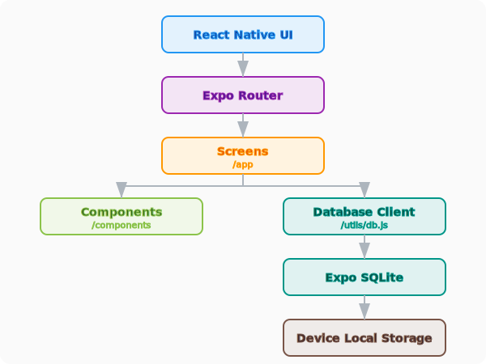

# Job Vault Mobile - Architecture Overview

This document provides a high-level overview of the architecture for the Job Vault mobile application. It is intended for developers who want to understand the system's components and how they interact.

## High-Level Architecture

Job Vault is a **local-first** mobile application built using **React Native** and **Expo**. All user data is stored locally on the device using a SQLite database, ensuring privacy, offline capability, and low latency.

## Technology Stack

- **Framework:** React Native with Expo
- **Routing:** Expo Router (File-based routing)
- **Database:** Expo SQLite (`expo-sqlite`)
- **State Management:** React Hooks and local state (leveraging the local-first nature)
- **Styling:** `react-native-paper` (Material Design) and `lucide-react-native` (Icons)
- **Package Manager:** `pnpm`

---

## 1. Frontend (FE)

The frontend is built using React Native and structured using **Expo Router**, which provides file-based routing similar to Next.js.

- **`app/` directory:** Contains the application's screens and navigation structure.
  - `_layout.jsx`: Defines the root navigation structure (e.g., Drawer, Tabs).
  - `index.jsx`, `calendar.jsx`, etc.: Individual screen components.
- **`components/` directory:** Contains reusable UI components shared across screens.
- **`utils/` directory:** Contains utility functions and the database client.

## 2. Data Persistence (SQLite)

Job Vault uses **SQLite** as its primary data store, specifically via the `expo-sqlite` library.

- **Database Engine:** `expo-sqlite` provides an asynchronous API to interact with a SQLite database stored on the device's filesystem.
- **Local-First:** There is no remote backend for user data. All `CRUD` operations happen directly against the local `jobvault.db` file.
- **Schema:** The database schema is defined and initialized programmatically in `utils/db.js`. See the [Database Schema](database-schema.md) for table details and migration strategy. It includes tables for `companies` and `calendar_events`.

## 3. Database Client (`utils/db.js`)

The application interacts with SQLite through a centralized client located in `utils/db.js`. This module provides:

- **Initialization:** The `initDatabase()` function creates the necessary tables if they don't exist and handles `PRAGMA` settings (like enabling foreign keys).
- **API Wrappers:** The `companiesApi` and `calendarEventsApi` objects provide high-level, asynchronous methods for common database operations:
  - `getAll()`, `getById()`, `create()`, `update()`, `delete()`
- **Access Pattern:** Screens and components import these API objects to fetch or modify data, abstracting the raw SQL queries away from the UI layer.

## 4. The Expo Aspect

**Expo** is used as the development platform and runtime for the application.

- **Development Workflow:** Developers use `pnpm expo start` to run the development server. The Expo Go app (or a development build) is used to preview the app on a physical device or emulator.
- **Configuration:** `app.json` and `app.config.js` contain the Expo-specific configuration, including app metadata, icons, and splash screens.
- **Native Modules:** Expo handles the bridging between JavaScript and native device capabilities (like the SQLite engine) through its library of managed modules.
- **Building:** Production builds are typically generated using EAS (Expo Application Services).

---

## Summary for Developers

1.  **Entry Point:** Start with `app/_layout.jsx` to understand the navigation.
2.  **Data Flow:** UI -> `utils/db.js` API -> `expo-sqlite` -> Local Storage.
3.  **Database Changes:** Modify the `initDatabase` SQL in `utils/db.js`. Since it uses `CREATE TABLE IF NOT EXISTS`, you may need to handle migrations manually if you change existing columns.
4.  **Running:** Always use `pnpm expo` commands as per project guidelines.
