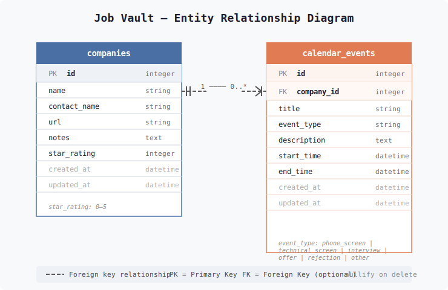

# Database Schema and Migration Strategy

This document describes the database structure for Job Vault Mobile and outlines the strategy for schema versioning and migrations during application updates.

## Database Overview

Job Vault Mobile uses **SQLite** via `expo-sqlite` for local data persistence. The database is stored on the device's local storage.

- **Database Name:** `jobvault.db`
- **Location:** Managed by `expo-sqlite` (standard app data directory).

## Entity Relationship Diagram

The following diagram illustrates the relationship between the main tables:

---

## Table Definitions

### 1. `companies`

Stores information about companies the user is tracking for job opportunities.

| Column         | Type     | Constraints               | Description                                 |
| :------------- | :------- | :------------------------ | :------------------------------------------ |
| `id`           | INTEGER  | PRIMARY KEY AUTOINCREMENT | Unique identifier for the company.          |
| `name`         | TEXT     | NOT NULL                  | The name of the company.                    |
| `url`          | TEXT     |                           | Company website or job posting URL.         |
| `contact_name` | TEXT     |                           | Primary contact person at the company.      |
| `notes`        | TEXT     |                           | General notes about the company.            |
| `star_rating`  | INTEGER  | DEFAULT 0                 | User-assigned rating (e.g., 0-5).           |
| `archived`     | BOOLEAN  | DEFAULT 0                 | Whether the company is archived (0 or 1).   |
| `created_at`   | DATETIME | DEFAULT CURRENT_TIMESTAMP | Timestamp when the record was created.      |
| `updated_at`   | DATETIME | DEFAULT CURRENT_TIMESTAMP | Timestamp when the record was last updated. |

### 2. `calendar_events`

Stores events related to the job search (interviews, follow-ups, etc.).

| Column           | Type     | Constraints               | Description                                                 |
| :--------------- | :------- | :------------------------ | :---------------------------------------------------------- |
| `id`             | INTEGER  | PRIMARY KEY AUTOINCREMENT | Unique identifier for the event.                            |
| `company_id`     | INTEGER  | FOREIGN KEY               | Reference to `companies(id)`.                               |
| `title`          | TEXT     | NOT NULL                  | Title of the event.                                         |
| `description`    | TEXT     |                           | Detailed description of the event.                          |
| `start_time`     | DATETIME | NOT NULL                  | Event start time.                                           |
| `end_time`       | DATETIME |                           | Event end time.                                             |
| `event_type`     | TEXT     | DEFAULT 'other'           | Type: `phone_screen`, `technical_screen`, `interview`, etc. |
| `selected_emoji` | TEXT     |                           | User-selected emoji for the event.                          |
| `created_at`     | DATETIME | DEFAULT CURRENT_TIMESTAMP | Timestamp when the record was created.                      |
| `updated_at`     | DATETIME | DEFAULT CURRENT_TIMESTAMP | Timestamp when the record was last updated.                 |

> **Note:** `company_id` uses `ON DELETE CASCADE`. Deleting a company will automatically remove all associated events.

---

## Migration Strategy & Schema Versioning

As Job Vault Mobile evolves, the database schema may need to change (e.g., adding columns, new tables). To support seamless updates for users via app stores (App Store / Google Play), we follow a versioned migration strategy.

### 1. Versioning Mechanism

The database version is tracked using a `user_version` PRAGMA in SQLite or a dedicated `schema_migrations` table.

Current strategy in `utils/db.js`:

- The application currently uses `CREATE TABLE IF NOT EXISTS` for basic initialization.
- For future updates, a version-tracking mechanism will be implemented to apply incremental SQL scripts.

### 2. Applying Migrations

When the application starts:

1.  **Check Version:** The app queries the current database version.
2.  **Compare:** If the app's required version is higher than the database version, it triggers migrations.
3.  **Execute:** Migrations are executed in sequence (e.g., `v1` to `v2`, `v2` to `v3`).
4.  **Update Version:** Upon success, the `user_version` is updated.

### 3. Handling App Store Updates

When a user updates the application from an app store:

- The existing SQLite database file (`jobvault.db`) is **preserved**.
- On the first launch after the update, the `initDatabase()` function (or migration manager) detects that the schema is out of date.
- Migrations run automatically before the user reaches the main UI, ensuring data integrity.

### 4. Best Practices for New Migrations

- **Additive Changes:** Prefer adding columns with `DEFAULT` values.
- **Data Integrity:** Always use transactions when running migrations to prevent database corruption if an update is interrupted.
- **Testing:** Every migration must be tested against a database populated with data from the _previous_ version to ensure no data loss occurs during the upgrade.

---

## Reference Architecture

For a broader view of how the database fits into the overall system, see [Architecture Overview](app-arch.md).
