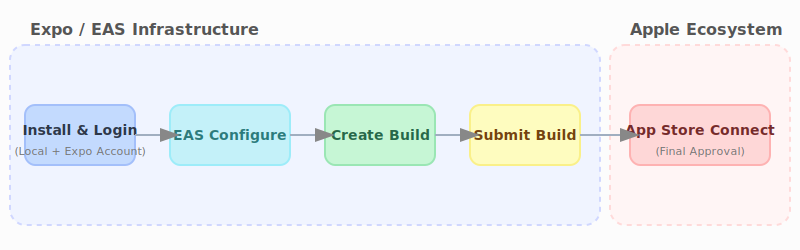

# Deploying to the App Store

This document describes how to build the **Job Vault** app and deploy it to the Apple App Store.



## Prerequisites

- **Apple Developer Account**: You need a paid account to publish on the App Store.
- **Expo Application Services (EAS)**: EAS is the toolset used to build and submit Expo apps.

## Step 1: Install and Log In to EAS CLI

---

### [ EXPO ACCOUNT REQUIRED ]

## Steps below involve your external Expo account.

1.  **Install the EAS CLI tool globally**:

    ```bash
    pnpm install -g eas-cli
    ```

2.  **Log in to your Expo account**:
    ```bash
    eas login
    ```

---

## Step 2: Project Configuration

Before building, ensure the project is configured for EAS:

1.  **Initialize EAS for your project**:
    ```bash
    eas build:configure
    ```
2.  **Verify `app.json`**: Make sure the `ios.bundleIdentifier` and `ios.supportsTablet` are correctly set. For **Job Vault**, the bundle identifier is `com.jobvault.app`.

## Step 3: Creating a Build for the App Store

To build your app for the App Store, you need to create a "production" build profile.

1.  **Run the build command**:
    ```bash
    eas build --platform ios --profile production
    ```
2.  **Follow the Prompts**: EAS will guide you through generating the necessary Apple certificates and provisioning profiles. If you have an existing identifier on Apple Developer Portal, EAS will ask if it can use it.

---

### [ APPLE DEVELOPER ACCOUNT REQUIRED ]

## This step interacts directly with your Apple Developer portal to manage certificates.

This process will create a `.ipa` file (iOS App Store Package) in the cloud. Once the build is finished, you can download it or directly submit it.

## Step 4: Submitting to the App Store

You can submit your build to the App Store directly using EAS:

---

### [ EXTERNAL SYSTEM INTEGRATION ]

## This step connects to both **Expo (EAS)** and **Apple (App Store Connect)**.

```bash
eas submit --platform ios
```

Follow the instructions in the terminal to select your build and complete the submission to **App Store Connect**.

## Step 5: Finalizing in App Store Connect

Once the build is uploaded:

---

### [ APP STORE CONNECT PORTAL ]

## All remaining steps take place on the external [App Store Connect](https://appstoreconnect.apple.com/) portal.

1.  Log in to [App Store Connect](https://appstoreconnect.apple.com/).
2.  Create a new app entry (if it's the first time).
3.  Fill in the app information (descriptions, screenshots, pricing, etc.).
4.  Select your build under the "Build" section of your app version.
5.  Submit your app for review.

## Summary of Commands

- `eas build:configure`: Set up EAS in the project.
- `eas build --platform ios`: Build for iOS.
- `eas submit --platform ios`: Submit build to App Store Connect.
- `pnpm expo build:ios` (deprecated): Use `eas build` instead.

**Note**: For detailed information on EAS build and submission, refer to the [official Expo documentation](https://docs.expo.dev/build/introduction/).
