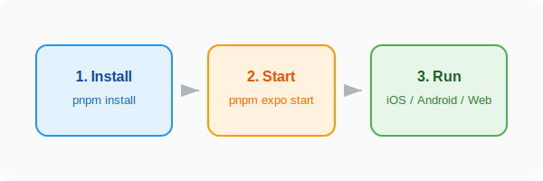

# Setup and Run

This guide provides instructions for setting up your local development environment and running the **Job Vault** mobile app.



## Prerequisites

Before you begin, ensure you have the following installed on your machine:

- **Node.js**: LTS version (v18 or newer recommended).
- **pnpm**: The project uses `pnpm` as its package manager. You can install it via `npm install -g pnpm`.
- **Expo Go App**: (Optional) For testing on a physical device, download the Expo Go app from the App Store (iOS) or Google Play Store (Android).
- **iOS Simulator / Android Emulator**: (Optional) For testing on your computer, ensure you have Xcode (macOS) or Android Studio installed and configured.

## Initial Setup

1.  **Clone the Repository** (if you haven't already):

    ```bash
    git clone <repository-url>
    cd job-vault-mobile
    ```

2.  **Install Dependencies**:
    Run the following command in the project root to install all necessary packages:
    ```bash
    pnpm install
    ```

## Running the Project

To start the development server, run:

```bash
pnpm expo start
```

This command will start the Expo development server. You will see a QR code in your terminal.

### Testing on a Physical Device

1.  Ensure your phone and computer are on the **same Wi-Fi network**.
2.  Open the **Expo Go** app on your device.
3.  Scan the QR code displayed in the terminal.
4.  The app will build and open on your device.

### Testing on a Simulator/Emulator

Once the development server is running, you can use the following keyboard shortcuts in the terminal:

- Press `i` to open the app in the **iOS Simulator**.
- Press `a` to open the app in the **Android Emulator**.

### Useful Commands

- `pnpm expo start --clear`: Starts the server and clears the cache. Useful if you're experiencing unexpected behavior.
- `pnpm prettier`: Formats all files in the project according to the style rules.

## Database Information

**Job Vault** uses **Expo SQLite** (`expo-sqlite`) for local-first data storage. The database is initialized and managed in `utils/db.js`. When running in development, the database file is stored locally on your device or simulator.
